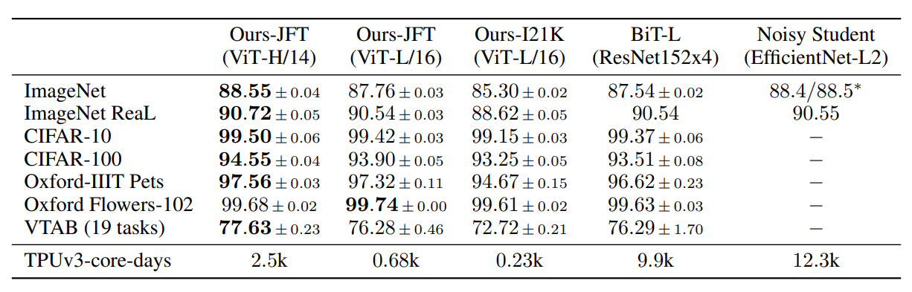

# Vision Transformer
Pytorch implementation of Vision Transformer (ViT) of the paper [An Image is Worth 16x16 Words: Transformers for Image Recognition at Scale](https://openreview.net/pdf?id=YicbFdNTTy) by Google Research, Brain Team. This paper demonstrates that the Transformer architecture can be applied effectively to domains outside of NLP, such as Computer Vision.


The Vision Transformer establishes new state‑of‑the‑art performance on image classification by splitting images into fixed‑size patches and processing them with a standard Transformer encoder. For classification, the authors follow the usual practice of prepending a learnable “classification token” to the patch sequence.

Equation (1)
the input to the Transformer by flattening each 𝑃×𝑃 image patch into a vector, projecting these with 𝐸 into 𝐷 dimensions, prepending a learnable classification token, and then adding a learnable positional embedding 𝐸pos to each token.
Equation (2) applies Layer Norm to the previous layer’s token embeddings, feeds the result into the multi‑head self‑attention module, and then adds back the original embeddings via a residual connection.
Equation (3) applies Layer Norm to the attention output, passes the result through the feed‑forward MLP, and then adds the original attention output back via a residual connection.
Equation (4) applies a final Layer Norm to the class token’s embedding output from the last encoder block, yielding 𝑦, which serves as the input for the subsequent classification head.

Ensure ViT has 12 layers in base model


## Parameters
- **img_size** : int  
  The size (height and width) of the input images; must be divisible by `patch_size`.

- **patch_size** : int  
  The height and width of each square patch; the number of patches is `(img_size // patch_size) ** 2`.

- **channels** : int  
  The number of channels in the input images (e.g. 3 for RGB).

- **hidden_size** : int  
  The dimensionality of the patch embedding and all hidden representations in the Transformer.

- **dropout** : float between 0 and 1  
  Dropout probability applied after patch embedding, attention weights, and in the MLP.

- **num_attention_heads** : int  
  The number of parallel attention heads in each multi‑head self‑attention block.

- **qkv_bias** : bool  
  Whether to include a learnable bias term in the query, key, and value projection layers.

- **intermediate_size** : int  
  The inner dimensionality of the MLP (feed‑forward) layer within each Transformer block.

- **num_hidden_layers** : int  
  The number of Transformer blocks in the encoder.

- **num_classes** : int  
  The number of output classes for the final classification head.

## Results
The model was trained on the CIFAR-10 dataset for 10 epochs with a batch size of 4. The model config was used to train the model:
```markdown
```python
config = {
    "patch_size": 4,  # Input image size: 32x32 -> 8x8 patches
    "hidden_size": 48,
    "num_hidden_layers": 4,
    "num_attention_heads": 4,
    "intermediate_size": 4 * 48, # 4 * hidden_size
    "dropout": 0.0,
    "hidden_dropout_prob": 0.0,
    "attention_probs_dropout_prob": 0.0,
    "initializer_range": 0.02,
    "img_size": 32,
    "num_classes": 10, # num_classes of CIFAR10
    "channels": 3,
    "qkv_bias": True,
    "use_faster_attention": True,
}
```
The model is much smaller than the original ViT model (base) from the paper (which has 12 layers and hidden size of 768) as I want to illustrate how the model works rather than achieving state-of-the-art performance. The result of the model is below

Train loss, test loss and accuracy of the model during training.

The model achieves 55.0% accuracy on the test set after 10 epochs of training.

## Reference
[Google's repository for the ViT model](https://github.com/google-research/vision_transformer), [Yannic Kilcher's video](https://www.youtube.com/watch?v=TrdevFK_am4&t=1125s), [Implementing Vision Transformer (ViT) from Scratch](https://medium.com/data-science/implementing-vision-transformer-vit-from-scratch-3e192c6155f0), [Original code](https://github.com/tintn/vision-transformer-from-scratch)

## License

1. **Original Code**  
   - License: MIT License (see `LICENSE.txt`)  
   - Source: https://github.com/tintn/vision-transformer-from-scratch

2. **My Modifications**  
   - License: MIT License (see `LICENSE-Modification.txt`)  
   - Modifier: Eunsol Choi  
   - Date: 2025‑07‑28
